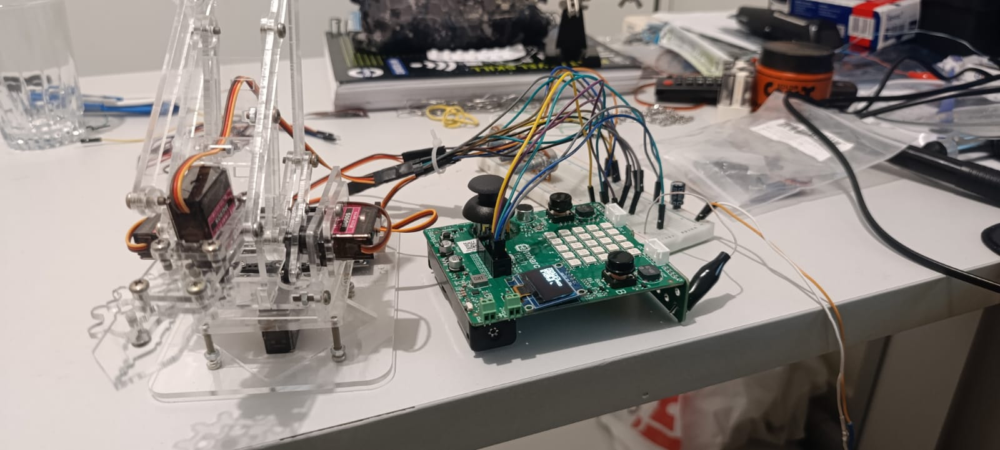

# Projeto de Braço Robótico com BitDogLab

## Descrição do Projeto

Este é um projeto de braço robótico de acrílico utilizando a plaquinha BitDogLab. O objetivo é controlar os servos do braço robótico usando um joystick e um display OLED via I2C para indicar quais motores estão sendo controlados. Os servos estão conectados nas portas 3, 4, 8 e 9. Para garantir a compatibilidade e o funcionamento correto dos servos, foi necessária a adaptação de uma biblioteca de C++ para C.

## Funcionalidades

- **Controle dos Servos com Joystick**: Utilizando um joystick, é possível controlar dois motores ao mesmo tempo. O display OLED mostra quais motores estão sendo controlados.
- **Alternância de Motores com Botão B**: Ao pressionar o botão B, o controle alterna para os outros dois motores, proporcionando um controle mais dinâmico.
- **Fonte de Alimentação Segura**: O sistema é conectado a uma fonte de 5V, 2A, com um capacitor de 470uF para evitar picos de corrente e proteger o equipamento. Cada motor consome cerca de 400mA, garantindo que a corrente não seja um problema.
- **Adaptação de Biblioteca**: A biblioteca dos servos foi adaptada de C++ para C para garantir o funcionamento adequado dos servos.

## Componentes Utilizados

- Plaquinha BitDogLab
- Braço robótico de acrílico
- Joystick
- Display OLED via I2C
- Servos (conectados nas portas 3, 4, 8 e 9)
- Fonte de 5V, 2A
- Capacitor de 470uF

## Como Funciona

1. **Controle dos Motores**:
   - O joystick controla inicialmente os motores conectados nas portas 3 e 4.
   - Ao pressionar o botão B, o controle alterna para os motores conectados nas portas 8 e 9.

2. **Alimentação**:
   - A fonte de 5V, 2A, fornece energia para o sistema.
   - O capacitor de 470uF é usado para estabilizar a corrente e evitar picos que possam danificar os componentes.

3. **Adaptação da Biblioteca**:
   - A biblioteca dos servos foi adaptada de C++ para C para garantir a compatibilidade e o funcionamento correto dos servos.

## Experiência e Aprendizado

Este projeto proporcionou uma excelente oportunidade de aprendizado sobre controle de servos e o uso da plaquinha BitDogLab. A adaptação da biblioteca e a integração dos componentes foram desafios interessantes, mas o resultado final foi um braço robótico totalmente funcional e dinâmico.

## Imagem do Projeto

## Vídeo do Projeto

